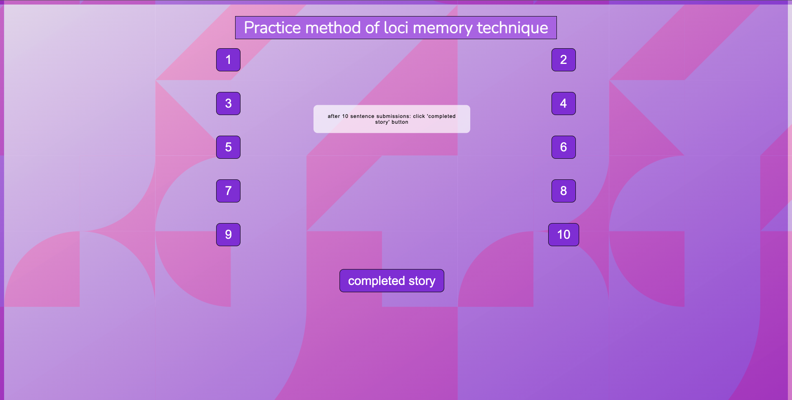
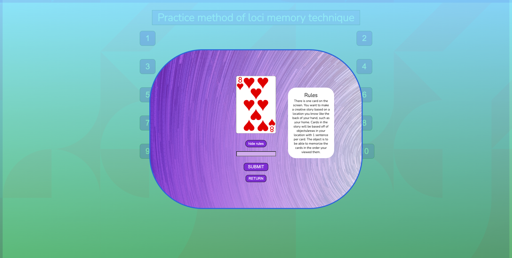

# Method of Loci Application

I had been practicing building up memory through method of loci technique, which involves building a story about the subjects I was trying to memorize. I was using a deck of cards online and a note editor to practice, so I built out an app to do it all on one user interface.

**Link to project: [Github]https://jscorz-mol.netlify.app**

<!-- 
 -->

MOL

---

## **How It's Made:**

---

**Tech used:** HTML, CSS, SASS, Javascript

I started building out all the buttons first in the HTML. Afterwards I built out the header and other elements in the markup and started styling the page through barebones CSS. After learning SASS, I converted the file structure over to SASS.
After all this was in place, I start adding functionality to the buttons by having them display a random card for each button clicked. I added onto this window with the random card and put a rules section to explain how to use the app. An input area for a sentence to be submitted and saved to local storage was next. Lastly I've added functionality to the completed story button that will allow the users to view the story before guessing face-down cards again.

## **Lesson's learned:**

---

I had fun learning how to add event listeners to the buttons and have a random card pop up in response to that. I also had a good time learning to style the page in different ways with CSS. This was one of my first projects, and I learned through building it.

## **Optimizations:**

---

After I worked with for loops and `forEach()` statement, I went back and changed some instances of functions to use `forEach()` to loop over buttons to add event listeners. This reduced the volume of code significantly from the original version
